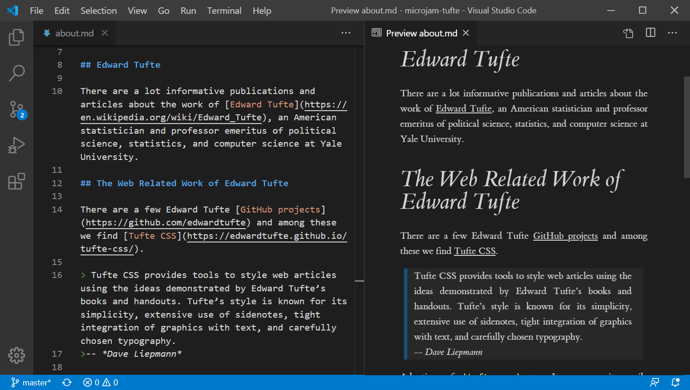

#  A Tufte Style Template for &mu;Jam

This is a site template for research articles, scientific online publications and students project work. In contrast to other templates *math* is configured here.

This template owns all features of *&mu;Jam simple* template.

Tufte Style is remarkable due to its outstanding typography. You can [read more about it](https://goessner.github.io/microjam-tufte/about) and see [an example](https://goessner.github.io/microjam-tufte/).
